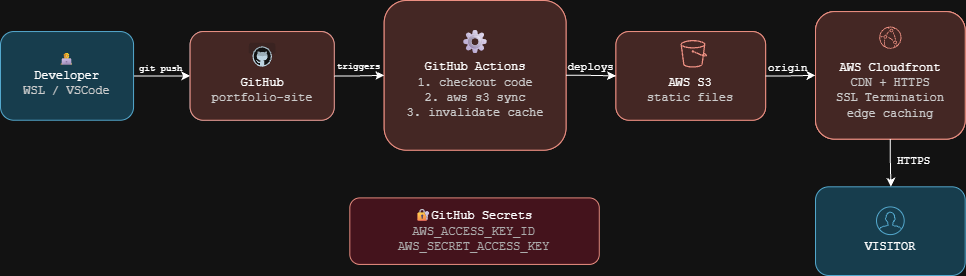

# Portfolio Site — AWS Static Hosting with CI/CD

A personal portfolio site deployed on AWS using S3 and CloudFront,
with automated deployments via GitHub Actions on every git push.

## Architecture

WLS → GitHub → GitHub Actions → S3 → CloudFront → Visitor

## Services Used

**S3** — stores static web files. Chosen over a 
traditional web server because static files need no compute, 
reducing cost to near zero.

**CloudFront** — CDN serving the site globally over HTTPS. Handles 
SSL termination and caches files at edge locations.

**GitHub Actions** — CI/CD pipeline that automatically syncs files 
to S3 and invalidates the CloudFront cache on every push. 
No manual deployment steps required.

**IAM** — programmatic user with credentials stored as GitHub 
Secrets. Never hardcoded in the pipeline.

## What I Broke and Fixed

**BlockPublicPolicy error** — AWS blocks public S3 access by 
default. Fixed by disabling Block Public Access via CLI before reapplying the policy.

**CloudFront origin connection failure** — a single character typo 
in the origin domain (amazon.aws.com vs amazonaws.com) caused 
CloudFront to silently accept an invalid origin. Diagnosed by 
isolating S3 with curl -I to confirm S3 was healthy, then 
inspecting the CloudFront origin config directly via CLI.

**GitHub Actions workflow scope error** — Personal Access Token 
generated without the workflow scope prevented pushing the Actions 
config file. Regenerated with both repo and workflow scopes.

## Next Steps

- Rebuild frontend in Next.js
- Add custom domain via Route 53
- Restrict S3 to CloudFront only using Origin Access Control
- Add Lambda contact form backend
